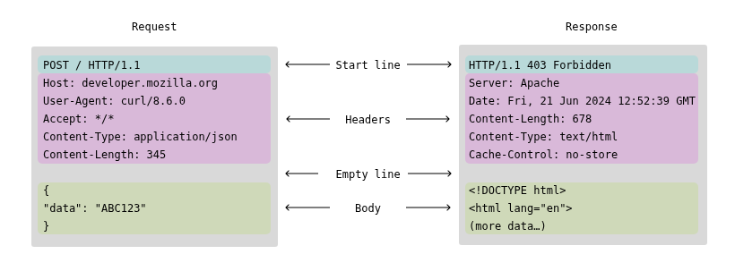

# 🌐 Webserv — A Lightweight Non-Blocking HTTP Server in C++

## 📖 Overview

**Webserv** is a high-performance, fully non-blocking HTTP server implemented in modern C++ (≥ C++11).  
It follows the [RFC 2616](https://datatracker.ietf.org/doc/html/rfc2616) HTTP/1.1 specification and uses **epoll** for scalable I/O multiplexing.

The goal of this project is to understand how a real web server like **NGINX** or **Apache** handles connections, parses requests, serves files, and interacts with **CGI** processes — all without blocking the main event loop.

---

# 🧠 Architecture Overview

### 🏗 High-Level Components

| Webserv                                                 |
| ------------------------------------------------------- |
| epoll (event loop)                                      |
| - monitors listening sockets (accept)                   |
| - monitors client sockets (read/write)                  |
| - monitors CGI pipes (read/write)                       |
| ------------------------------------------------------- |
| Core Modules:                                           |	-> detects new connections, readable/writable sockets, CGI pipe readiness
| - ConfigParser: parse config file                       | -> loads and interprets the .conf
| - Server: manage listeners and clients                  | -> creates socket, bind ports, listens & register them with epoll
| - Connection: track state of each client                | -> tracks the connection’s current state (WAIT_REQUEST → READING → WRITING → COMPLETE).
| - RequestParser: parse HTTP requests                    | -> Converts raw bytes into a structured Request object, 
|                                                         |     Parses HTTP method, path, headers, and body (supports chunked encoding)
| - ResponseBuilder: build HTTP responses                 | -> Builds and serializes the outgoing HTTP response.
| - CgiHandler: execute and monitor CGI**                 | -> Forks subprocesses, sets environment variables, pipes input/output, and returns script output
| - Logger: structured logging        enum class ConnectionState { WAIT_REQUEST, READING, PROCESSING, WRITING, COMPLETE };                    | -> Handles logging for debugging and access/error logs
| ------------------------------------------------------- |

---

┌────────────────────────────────────────┐
│                epoll                   │
│  monitors all fds:                     │
│   - listening sockets  (Server)        │
│   - client sockets     (Connection)    │
│   - CGI pipes          (CgiHandler)    │
│                                        │
│  epoll_wait() returns ready fds →      │
│  dispatches event to correct handler   │
└────────────────────────────────────────┘


### 🧩 4. Transition Diagram

```text
		┌──────────────────┐
		│  WAIT_REQUEST    │
		└──────┬───────────┘
			   │ EPOLLIN (data)
			   ▼
		┌──────────────────┐
		│ READING_REQUEST  │
		└──────┬───────────┘
			   │ request complete
			   ▼
		┌──────────────────┐
		│ PROCESSING       │
		└──────┬───────────┘
			   │ static website  │ CGI request
			   │              ▼
			   │         ┌──────────────┐
			   │         │ CGI_RUNNING  │
			   │         └──────┬───────┘
			   │ CGI output     │
			   ▼                ▼
		┌──────────────────┐  ┌─────────────────┐
		│ WRITING_RESPONSE │  │ CGI_READING     │
		└──────┬───────────┘  └──────┬──────────┘
			   │ EPOLLOUT            │ EOF
			   ▼                     ▼
		┌──────────────────┐
		│ COMPLETE         │
		└──────┬───────────┘
			   │
		 keep-alive?
		   │    │
		   │    ▼
		   │  WAIT_REQUEST
		   │
		   ▼
		 CLOSING

---
## 🧩 Internal Data Flow

WAIT_REQUEST → READING_REQUEST → READY → WRITING_RESPONSE → COMPLETE

# 🌐 Webserv Project Overview

A lightweight HTTP server in C++ supporting **static files**, **CGI scripts**, **keep-alive**, and **chunked transfer encoding**.  

---

## ⚡ Typical Request Lifecycle

<details>
<summary>Click to expand</summary>

```text
Client
  │
  ▼
[epoll_wait()]
  │
  ├──> Accept new client (EPOLLIN on listening socket)
  │
  ├──> Read request (EPOLLIN)
  │       ↓
  │   RequestParser
  │       ↓
  │   Route lookup → static website | CGI
  │
  ├──> If static:
  │       read() file → ResponseBuilder → send()
  │
  ├──> If CGI:
  │       CgiHandler forks → pipe()
  │       collect stdout → ResponseBuilder
  │
  └──> Send response (EPOLLOUT)
		  ↓
		close() when done


---

### Request Lifecycle (keep connection alive(HTTP1.1, no close) & chunked transfer)
<details> <summary>Click to expand</summary>
[epoll_wait()]
  │
  ├──> Read request
  │       - If new request
  │       - Parse headers
  │       - Detect keep-alive / chunked
  │
  ├──> Write response
  │       - If Content-Length known → normal write
  │       - Else → chunked encoding
  │
  ├──> If keep-alive → reset state
  │       else → close socket


---

## ⚙️ Directory Structure
<details> <summary>Click to expand</summary>

webserv/
├── include/
│   ├── core/
│   │   ├── Config.hpp
│   │   ├── Logger.hpp
│   │   └── Utils.hpp
│   ├── server/
│   │   ├── Server.hpp
│   │   ├── Connection.hpp
│   │   ├── RequestParser.hpp
│   │   ├── ResponseBuilder.hpp
│   │   └── CgiHandler.hpp
│   └── http/
│       ├── Request.hpp
│       └── Response.hpp
│
├── src/
│   ├── core/
│   │   ├── Config.cpp
│   │   ├── Logger.cpp
│   │   └── Utils.cpp
│   ├── server/
│   │   ├── Server.cpp
│   │   ├── Connection.cpp
│   │   ├── RequestParser.cpp
│   │   ├── ResponseBuilder.cpp
│   │   └── CgiHandler.cpp
│   └── main.cpp
│
├── config/
│   └── default.conf
│
├── www/
│   ├── index.html
│   ├── upload/
│   └── cgi-bin/
│       └── test.py
│
├── logs/
│   ├── access.log
│   └── error.log
│
├── Makefile
└── README.md


</details>
---

## 🧱 CGI Lifecycle (Non-Blocking)
<details> <summary>Click to expand</summary>
[Client]
  │
  ▼
Webserv (EPOLLIN)
  │
  ├── Parse request and detect CGI extension
  │
  ├── Setup environment variables:
  │     - CONTENT_LENGTH, CONTENT_TYPE
  │     - REQUEST_METHOD, QUERY_STRING
  │     - SCRIPT_FILENAME, SERVER_PROTOCOL, etc.
  │
  ├── Create two pipes:
  │     - pipe_in:  send request body → CGI stdin
  │     - pipe_out: receive CGI stdout → response
  │
  ├── fork() + execve(script_path, envp)
  │
  ├── parent registers pipe_out[0] to epoll
  │     (non-blocking read from CGI output)
  │
  ├── child runs interpreter (e.g. /usr/bin/python3)
  │     and writes output to pipe_out[1]
  │
  ├── parent reads CGI output as stream:
  │     "Content-Type: text/html\r\n\r\n<html>..."
  │
  └── ResponseBuilder wraps it into valid HTTP response

Everything stays non-blocking — no waitpid() or read() blocking calls.
The CGI’s pipe file descriptors are monitored by epoll just like sockets.
</details> ```
---


## HTTP layer

struct Request
{
	std::string method;
	std::string path;
	std::map<std::string, std::string> headers;
	std::string body;
};





